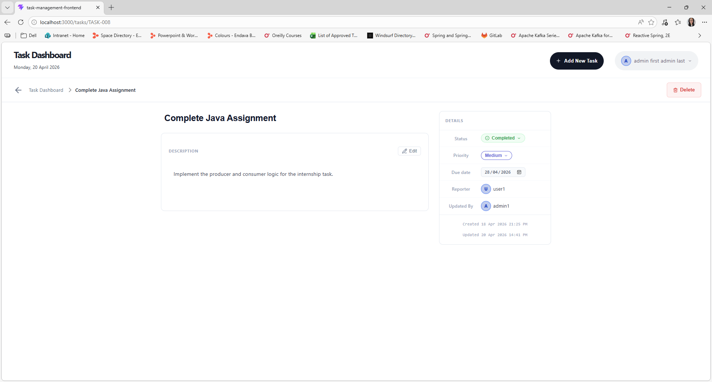

# Intern Assignment - Task Management System with Kafka, Keycloak, and React

A reactive RESTful Task Management System built with Spring Boot WebFlux, Apache Kafka, MongoDB, Keycloak IAM, and a React frontend. It demonstrates full CRUD operations with an event-driven, asynchronous architecture, role-based access control, and ownership-based authorization.

## Table of Contents
- [Architecture Overview](#architecture-overview)
- [Installation](#installation)
- [Tech Stack](#tech-stack)
- [Usage Example](#usage-example)
- [API Endpoints](#api-endpoints)
- [Features](#features)
- [Security & Authorization](#security--authorization)
- [Kafka Integration](#kafka-integration)
- [Webhook Integration](#webhook-integration)
- [Exception Handling](#exception-handling)
- [Business Rules & Assumptions](#business-rules--assumptions)
- [React Frontend](#react-frontend)
- [Keycloak Configuration](#keycloak-configuration)
- [Testing](#testing)
- [Project Structure](#project-structure)

## Architecture Overview
This application applies Event-Driven Architecture and CQRS pattern. Controllers immediately publish a Kafka event. The Kafka consumer then handles the actual database operation and fires a webhook callback on success or failure.
   ```
   Browser (React) → Keycloak (Auth) → Spring Boot API (JWT validation)
                                            ↓
   Controller → KafkaClientService (ownership check) → TaskEventProducer → Kafka Broker (task_events topic)
                                                                                  ↓
                                                                         TaskEventConsumer → TaskService (MongoDB)
                                                                                  ↓
                                                                           WebhookService
   ```

## Installation
### Prerequisites
- Java 21
- Maven 3.9+
- Node.js 18+ (for React frontend)
- Docker & Docker Compose (Rancher Desktop)
- MongoDB (default: `localhost:27017`) — or via Docker
- Apache Kafka (default: `localhost:9092`) with Zookeeper — or via Docker
- Keycloak (default: `localhost:8080`) — or via Docker

### Steps
1. Clone the repository
   ```bash
   git clone https://github.com/your-username/internship-assignment-kafka.git
   cd internship-assignment-kafka
   ```
2. Open the backend project in IntelliJ IDEA and ensure Maven dependencies are resolved
   ```bash
   cd internship-assignment-kafka/internship-assignment-kafka
   ```
3. Configure the backend by editing `src/main/resources/application-docker.properties` 

   ```properties
   spring.application.name=internship-assignment-kafka
   
   # MongoDB
   spring.mongodb.uri=mongodb://mongo:27017/TaskManagementSystem
   
   # Kafka Broker
   spring.kafka.bootstrap-servers=kafka:9092
   
   # Producer config
   spring.kafka.producer.key-serializer=org.apache.kafka.common.serialization.StringSerializer
   spring.kafka.producer.value-serializer=org.springframework.kafka.support.serializer.JsonSerializer
   spring.kafka.producer.properties.spring.json.add.type.headers=false
   
   # Consumer config
   spring.kafka.consumer.group-id=task-group
   spring.kafka.consumer.key-deserializer=org.apache.kafka.common.serialization.StringDeserializer
   spring.kafka.consumer.value-deserializer=org.springframework.kafka.support.serializer.ErrorHandlingDeserializer
   spring.kafka.consumer.properties.spring.deserializer.value.delegate.class=org.springframework.kafka.support.serializer.JsonDeserializer
   spring.kafka.consumer.properties.spring.json.trusted.packages=*
   spring.kafka.consumer.properties.spring.json.value.default.type=org.example.internshipassignmentkafka.kafka.TaskEvent
   spring.kafka.consumer.properties.spring.json.use.type.headers=false
   spring.kafka.consumer.enable-auto-commit=false
   spring.kafka.consumer.auto-offset-reset=earliest
   spring.kafka.listener.ack-mode=MANUAL_IMMEDIATE
   
   logging.level.org.apache.kafka.clients.consumer.internals.ConsumerCoordinator=WARN
   logging.level.org.apache.kafka.clients.consumer.internals.ClassicKafkaConsumer=WARN
   logging.level.org.apache.kafka.clients.NetworkClient=WARN
   logging.level.org.apache.kafka.clients.Metadata=WARN
   
   spring.security.oauth2.resourceserver.jwt.jwk-set-uri=http://keycloak:8080/realms/internship-task-realm/protocol/openid-connect/certs
   spring.security.oauth2.resourceserver.jwt.issuer-uri=http://localhost:8080/realms/internship-task-realm
   
   server.port=8081
   ```

4. Configure Webhook Tester in `src/main/resources/application.properties`
   ```properties
   webhook.callback-url=https://webhooktest.net/webhook
   webhook.callback-path=/{bucketID}
   ```

## Usage Example
1. Running the Full Stack with Docker
   The project includes a `docker-compose.yml` that starts MongoDB, Zookeeper, Kafka, Keycloak, the Spring Boot backend, and the React frontend together:
   ```bash
   docker compose up --build
   ```
   To stop and remove all containers:
   ```bash
   docker compose down
   ```
   After startup, the following services are available:
   
   | Service        | URL                          |
   |----------------|------------------------------|
   | React Frontend | http://localhost:3000         |
   | Spring Boot API| http://localhost:8081         |
   | Keycloak       | http://localhost:8080         |
   | MongoDB        | localhost:27017               |
   | Kafka          | localhost:29092 (host access) |

2. Monitor Kafka events in real time
   ```bash
   docker exec -it kafka kafka-console-consumer --bootstrap-server localhost:9092 --topic task-events --from-beginning
   ```
3. Monitor Dead Letter Topic
   ```bash
   docker exec -it kafka kafka-console-consumer --bootstrap-server localhost:9092 --topic task-events-dead-letter --from-beginning
   ```
4. Monitor Spring Boot application logs
   ```bash
   docker compose logs -f app
   ````
5. Test API Endpoints using Postman. All endpoints require a Bearer token in the `Authorization` header:
   ```
   Authorization: Bearer <access_token>
   ```
   Obtain a token from Keycloak:
   ```bash
   curl -X POST http://localhost:8080/realms/internship-task-realm/protocol/openid-connect/token \
     -d "client_id=task-backend" \
     -d "username=user1" \
     -d "password=<password>" \
     -d "grant_type=password" \
     -d "client_secret=<task-backend client_secret>"
   ```
6. Watch WebHook Tester web page (Reference: https://webhooktest.net/bucket/019d27dc-df0f-7124-afd4-befd21eb209c)

## API Endpoints
### Tasks
All write operations return `202 Accepted` immediately (async via Kafka). All endpoints require a valid Keycloak JWT.

| Method   | Endpoint              | Description                                      | Response       | Role Required |
|----------|-----------------------|--------------------------------------------------|----------------|---------------|
| `POST`   | `/api/tasks`          | Publish a create event for a new task            | `202 Accepted` | USER, ADMIN   |
| `GET`    | `/api/tasks`          | Get all tasks (paginated)                        | `200 OK`       | USER, ADMIN   |
| `GET`    | `/api/tasks/{taskId}` | Get a specific task by ID                        | `200 OK`       | USER, ADMIN   |
| `PATCH`  | `/api/tasks/{taskId}` | Publish an update event (ownership enforced)     | `202 Accepted` | USER, ADMIN   |
| `DELETE` | `/api/tasks/{taskId}` | Publish a delete event (ownership enforced)      | `202 Accepted` | USER, ADMIN   |

#### Query Parameters for GET /api/tasks

| Parameter   | Default      | Description                                  |
|-------------|--------------|----------------------------------------------|
| `page`      | `0`          | Page number (zero-based)                     |
| `size`      | `10`         | Number of items per page                     |
| `sortBy`    | `createdAt`  | Field to sort by                             |
| `direction` | `desc`       | Sort direction: `asc` or `desc`              |

#### Paginated Response Structure

```json
   {
     "content": ["..."],
     "totalElements": 42,
     "totalPages": 5,
     "currentPage": 0,
     "pageSize": 10,
     "first": true,
     "last": false
   }
```

## Features

### Task Management
- Full CRUD with a reactive, non-blocking stack (Spring WebFlux + Reactive MongoDB)
- Each task has a unique `taskId` (application-generated) and a MongoDB `_id`
- Tasks include title, description, priority, due date, and status
- Automatic `createdAt` and `updatedAt` timestamp tracking
- Automatic `createdBy` and `updatedBy` population from the authenticated user's JWT

### Task Properties

| Field         | Rules                                             |
|---------------|---------------------------------------------------|
| `taskId`      | Unique, application-generated (e.g. `TASK-001`)   |
| `title`       | Required, 3–35 characters                         |
| `description` | Required, 10–500 characters                       |
| `priority`    | Required — `LOW`, `MEDIUM`, `HIGH`                |
| `status`      | Defaults to `PENDING` on creation; updatable      |
| `dueDate`     | Required, present or future date                  |
| `createdAt`   | Set on creation                                   |
| `updatedAt`   | Updated on every modification                     |
| `createdBy`   | Populated from JWT `preferred_username` on create |
| `updatedBy`   | Populated from JWT `preferred_username` on update |

### Validation
- Enforced via Jakarta Bean Validation on all request DTOs
- `@NotBlank`, `@Size`, `@NotNull`, `@FutureOrPresent` on create requests
- `@Pattern` + `@Size` on optional update fields (allows null but rejects blank strings)
- All validation messages are centralized in `ValidationMessages`

## Security & Authorization
### Authentication
All endpoints (except Keycloak's own endpoints) require a valid Keycloak-issued JWT Bearer token. The backend validates the token using the Keycloak JWK Set URI.

### Roles

| Role          | Permissions                                                |
|---------------|------------------------------------------------------------|
| `ADMIN`       | Create, view, update, and delete **any** task              |
| `USER`        | Create and view any task; update/delete **own** tasks only |
| `- (NO_ROLE)` | Is forbidden to access any endpoints or pages              |

Roles are extracted from the JWT claim `realm_access.roles` and mapped with the `ROLE_` prefix by Spring Security.

### Ownership Enforcement
For `PATCH` and `DELETE`, the `KafkaClientService` checks the `createdBy` field of the task against the `preferred_username` in the JWT before publishing the Kafka event. If the user is not the owner and not an ADMIN, a `403 Forbidden` is returned.

```
USER alice → PATCH /api/tasks/TASK-001 (created by alice) → Allowed
USER bob   → PATCH /api/tasks/TASK-001 (created by alice) → 403 Forbidden
ADMIN      → PATCH /api/tasks/TASK-001 (created by alice) → Allowed
- (NO_ROLE) ginger → POST, PATCH, GET, DELETE -> 403 Forbidden
```

### Security Configuration (Docker environment)

Configured via environment variables in `docker-compose.yml`:

```properties
SPRING_SECURITY_OAUTH2_RESOURCESERVER_JWT_ISSUER_URI=http://localhost:8080/realms/internship-task-realm
SPRING_SECURITY_OAUTH2_RESOURCESERVER_JWT_JWK_SET_URI=http://keycloak:8080/realms/internship-task-realm/protocol/openid-connect/certs
```

## Kafka Integration

### Complete Backend Flow

This diagram reflects exactly how a write request travels through the system, from the authenticated HTTP call to the final MongoDB write and webhook callback:

```
┌─────────────────────────────────────────────────────────────────────────────────┐
│  HTTP Layer                                                                     │
│                                                                                 │
│  React → POST/PATCH/DELETE /api/tasks                                           │
│           (Authorization: Bearer <JWT>)                                         │
│                │                                                                │
│                ▼                                                                │
│  SecurityConfig (Spring Security)                                               │
│    • Validates JWT against Keycloak JWKS endpoint                               │
│    • Extracts realm_access.roles → maps to ROLE_ADMIN / ROLE_USER               │
│                │                                                                │
│                ▼                                                                │
│  TaskController                                                                 │
│    • Delegates immediately to KafkaClientService                                │
│    • Returns 202 Accepted (never touches MongoDB directly)                      │
│                │                                                                │
│                ▼                                                                │
│  KafkaClientService                                                             │
│    • Reads preferred_username from JWT via SecurityUtils                        │
│    • For PATCH/DELETE: fetches task from MongoDB, checks createdBy === username │
│    • Non-owner non-admin → throws AccessDeniedException → 403 Forbidden         │
│                │                                                                │
│                ▼                                                                │
│  TaskEventProducer                                                              │
│    • Generates TASK-XXX ID (create only) via SequenceGeneratorService           │
│    • Serialises payload to JSON string                                          │
│    • Wraps in TaskEvent { eventType, timestamp, payload }                       │
│    • Sends to task-events topic                                                 │
└────────────────────────────────┬────────────────────────────────────────────────┘
                                 │  Kafka Broker
                                 │  topic: task-events
                                 ▼
┌─────────────────────────────────────────────────────────────────────────────────┐
│  Consumer Layer                                                                 │
│                                                                                 │
│  TaskEventConsumer                                                              │
│    │                                                                            │
│    ├─ TaskEventValidator                                                        │
│    │    • Event-level check: non-null type, known type, non-blank payload       │
│    │    • JSON Schema validation (schemas/ directory)                           │
│    │    • Due date: must be present or future                                   │
│    │                                                                            │
│    │    Valid ──────────────────────────────────────────────────────────┐       │
│    │    Invalid → DeadLetterProducer → task-events-dead-letter topic    │       │
│    │                                                                    │       │
│    └─ TaskEventHandlerRegistry  (Strategy Pattern — see below)          │       │
│         • Looks up handler by eventType string                          │       │
│         • Calls handler.handle(event)                                   │       │
│                                  ◄──────────────────────────────────────┘       │
│                                                                                 │
│  ┌──────────────────┬───────────────────┬──────────────────┐                    │
│  │ CreateTaskHandler│ UpdateTaskHandler │ DeleteTaskHandler│                    │
│  │  TASK_CREATED    │  TASK_UPDATED     │  TASK_DELETED    │                    │
│  └────────┬─────────┴────────┬──────────┴────────┬─────────┘                    │
│           │                  │                   │                              │
│           └──────────────────┴───────────────────┘                              │
│                              │                                                  │
│                              ▼                                                  │
│  TaskService  (MongoDB write via Reactive Repository)                           │
│    • createTask → sets taskId, status=PENDING, createdBy, updatedBy             │
│    • updateTask → applies partial fields, sets updatedBy                        │
│    • deleteTask → removes document                                              │
│                              │                                                  │
│                              ▼                                                  │
│  WebhookService                                                                 │
│    • POST callback to configured URL with SUCCESS / FAILED status               │
│    • Failures are logged and swallowed (do not affect offset commit)            │
│                              │                                                  │
│                              ▼                                                  │
│  consumer.commitAsync()  — offset committed only after full pipeline            │
└─────────────────────────────────────────────────────────────────────────────────┘
```

### Strategy Pattern — `TaskEventHandler`

The consumer uses the **Strategy Pattern** to decouple event routing from event handling. Each handler is a concrete strategy for one event type. The registry acts as the context that selects the correct strategy at runtime.
**Interface (Strategy):**
   ```java
   public interface TaskEventHandler {
       String getEventType();         
       Mono<Void> handle(TaskEvent event);  
   }
   ```
**Concrete Strategies:**

| Class               | `getEventType()`  | Responsibility                                          |
|---------------------|-------------------|---------------------------------------------------------|
| `CreateTaskHandler` | `TASK_CREATED`    | Deserialises `CreateTaskPayload`, calls `createTask()`  |
| `UpdateTaskHandler` | `TASK_UPDATED`    | Deserialises `TaskUpdatedPayload`, calls `updateTask()` |
| `DeleteTaskHandler` | `TASK_DELETED`    | Deserialises `String` taskId, calls `deleteTask()`      |

### Topics

| Topic                    | Partitions | Replicas | Purpose                          |
|--------------------------|------------|----------|----------------------------------|
| `task-events`            | 3          | 1        | Primary event bus                |
| `task-events-dead-letter`| 1          | 1        | Invalid or unprocessable events  |

### TaskEvent Structure

```java
public class TaskEvent {
   private String eventType;    // "TASK_CREATED", "TASK_UPDATED", or "TASK_DELETED"
   private LocalDateTime timestamp;
   private Object payload;      // CreateTaskPayload | TaskUpdatedPayload | String (taskId)
}
```

### Event Payloads

| Event Type     | Payload Record        | Contents                                          |
|----------------|-----------------------|---------------------------------------------------|
| `TASK_CREATED` | `CreateTaskPayload`   | `taskId`, `CreateTaskRequest`, `actorUsername`    |
| `TASK_UPDATED` | `TaskUpdatedPayload`  | `taskId`, `UpdateTaskRequest`, `actorUsername`    |
| `TASK_DELETED` | `String`              | `taskId`                                          |

### Event Validation

Events are validated via `TaskEventValidator` before processing in TaskHandler:
- **Event-level**: non-null event type, known event type, non-blank payload
- **JSON Schema**: validated against schemas in `src/main/resources/schemas/`
- **Due date**: `dueDate` must not be in the past for `TASK_CREATED` and `TASK_UPDATED`
Invalid events are sent to the dead letter topic with a list of validation failure reasons.

## Webhook Integration

After each Kafka event is processed, the system sends an HTTP POST callback to a configured webhook URL.

### Configuration
   ```properties
    webhook.callback-url=https://webhooktest.net/webhook
    webhook.callback-path=/{bucketID}
   ```
### Callback Payload
   ```json
   {
     "eventType": "TASK_CREATED",
     "taskId": "abc-123",
     "status": "SUCCESS",
     "message": "Task processed successfully",
     "processedAt": "2025-07-01T10:30:00"
   }
   ```
| Field         | Values              | Description                          |
|---------------|---------------------|--------------------------------------|
| `status`      | `SUCCESS`, `FAILED` | Outcome of the database operation    |
| `message`     | String              | Success message or error description |
| `processedAt` | LocalDateTime       | When the event was processed         |

Webhook failures are logged but do not interrupt event processing, the consumer continues running.

## Exception Handling

All exceptions are handled by `GlobalExceptionHandler` and return a consistent `ApiErrorResponse` body.

| Exception                      | HTTP Status | Trigger                                                                         |
|--------------------------------|-------------|---------------------------------------------------------------------------------|
| `TaskNotFoundException`        | `404`       | `taskId` does not exist in MongoDB                                              |
| `EmptyUpdateRequestException`  | `400`       | PATCH request body has no fields set                                            |
| `KafkaPublishFailedException`  | `500`       | Kafka event could not be published from the controller                          |
| `AccessDeniedException`        | `403`       | Authenticated user does not have ownership or admin rights                      |
| `WebExchangeBindException`     | `400`       | Bean validation fails on a request field                                        |
| `ServerWebInputException`      | `400`       | Malformed request body or invalid enum value in JSON                            |
| Unauthenticated requests       | `401`       | Missing or invalid JWT Bearer token                                             |

### Error Response Body

```json
{
  "timestamp": "2026-04-01T10:20:00",
  "status": 403,
  "error": "Forbidden",
  "message": "You are not allowed to modify this task",
  "path": "/api/tasks/TASK-001"
}
```

## Business Rules & Assumptions

1. **Async writes** - All create, update, and delete operations go through Kafka. The controller never writes to MongoDB directly.
2. **Ownership check before publish** - The `KafkaClientService` performs ownership/admin checks against MongoDB *before* publishing the Kafka event, so unauthorized requests are rejected at the HTTP layer.
3. **Actor tracking** - `createdBy` is set at task creation from the authenticated user's JWT; `updatedBy` is updated on every modification.
4. **Partial updates** - Only fields present in the `UpdateTaskRequest` are applied; unset fields remain unchanged.
5. **Status defaults** - Tasks are always created with `PENDING` status regardless of any client input.
6. **Webhook effort** - Failures in webhook delivery are logged and swallowed; they do not roll back the database operation.
7. **Dead letter** - Events that fail JSON Schema validation or due date checks are sent to `task-events-dead-letter` instead of being retried.
8. **Manual offset commit** - Kafka offsets are committed manually after each event is fully processed (including dead-lettering), preventing reprocessing of invalid events.

## React Frontend
### Routes

| Route                    | Component / Element    | Access Guard             | Description                              |
|--------------------------|------------------------|--------------------------|------------------------------------------|
| `/`                      | `HomePage`             | `requireAuth()`          | Kanban board — tasks grouped by status   |
| `/tasks/new`             | `CreateTaskModal`      | `requireAuth()`          | Modal overlay for creating a task        |
| `/tasks/:taskId`         | `TaskDetailsPage`      | `requireAuth()`          | Inline-editable task detail view         |
| `/tasks/:taskId/delete`  | `DeleteTaskModal`      | `requireTaskOwnership()` | Confirm-delete modal (owner or ADMIN)    |
| `/tasks/:taskId/update`  | *(action only)*        | `requireTaskOwnership()` | Handles update form submission           |
| `*`                      | `NotFoundPage`         | —                        | Catch-all 404                            |

Error boundaries on each route render `NotFoundPage` (404), `ForbiddenPage` (403), or `SomethingWentWrongPage` for other errors.

### Authentication & Authorization Flow

Authentication uses the **PKCE Authorization Code flow** via `react-oauth2-code-pkce`:

1. `useAuthReady()` checks `AuthContext` for `token` and `loginInProgress`.
2. `App` delays router creation until auth status is `"ready"` (token resolved) using `useMemo`. While `"loading"`, loading message will be displayed. While `"unauthenticated"`, `logIn()` is called to redirect to Keycloak.
3. Route loaders call `requireAuth()` or `requireTaskOwnership()` (from `auth/auth.js`) which read and decode the JWT directly from `localStorage` (`ROCP_token`), extracting `realm_access.roles` and `preferred_username`.
4. `useAuthData()` hook exposes the same auth state reactively via `AuthContext` for use in components.
```
Keycloak login → PKCE redirect → token stored → useAuthReady: "ready" → router created → routes protected
```

**Role extraction from JWT:**
   ```javascript
   // Roles from: tokenData.realm_access.roles
   const isAdmin = roles.includes("ADMIN");
   const isUser  = roles.includes("USER");
   ```

**Ownership check (loader-level):**
   ```javascript
   // requireTaskOwnership fetches the task and compares createdBy === username
   // Throws 403 Response if not owner and not ADMIN
   ```

**UI-level authorization:**
   ```javascript
   // canModify helper from useAuthData:
   canModify: (task) => isAdmin || task?.createdBy === username
   // Used to show/hide Edit, Delete buttons and enable/disable inline editing
   ```

### Key Components & Features

**HomePage Dashboard**


**Task Details Page**


**AddNewTask Modal**


### Form Validation

Frontend validation uses **Zod** schemas (`createTaskSchema`, `updateTaskSchema`).

### API Communication

All requests go through an **Axios instance** (`axiosInstance`) with the base URL pointing to the backend (`http://localhost:8081/api`). The JWT Bearer token is automatically attached via a request interceptor on every call.
   ```javascript
   // apiService.js methods:
   taskApi.getAllTasks(page, size, sortBy, direction)  
   taskApi.getTask(taskId)
   taskApi.createTask(createTaskRequest)
   taskApi.updateTask(taskId, updateTaskRequest)
   taskApi.deleteTask(taskId)
   ```

### Frontend Configuration

**`authConfig.js` - Keycloak PKCE settings:**
```javascript
export const authConfig = {
  clientId: "task-frontend",
  authorizationEndpoint:
    "http://localhost:8080/realms/internship-task-realm/protocol/openid-connect/auth",
  tokenEndpoint:
    "http://localhost:8080/realms/internship-task-realm/protocol/openid-connect/token",
  logoutEndpoint:
    "http://localhost:8080/realms/internship-task-realm/protocol/openid-connect/logout",
  redirectUri:    "http://localhost:3000",
  logoutRedirect: "http://localhost:3000",
  scope: "openid email profile",
  pkce: true,
  codeChallengeMethod: "S256",
};
```

**`axiosInstance.js`**
```javascript
const axiosInstance = axios.create({ baseURL: "http://localhost:8081/api" });
 
// Interceptor: reads token from localStorage and attaches it to every request
axiosInstance.interceptors.request.use((config) => {
  const raw = localStorage.getItem("ROCP_token");
  if (raw) config.headers.Authorization = `Bearer ${raw}`;
  return config;
});
```

### Docker
The React app is built and served via Nginx in a Docker container:
   ```bash
   # Frontend available at:
   http://localhost:3000
   ```

## Keycloak Configuration

### Realm Setup

| Setting          | Value                     |
|------------------|---------------------------|
| Realm            | `internship-task-realm`   |
| Frontend Client  | `task-frontend`           |
| Backend Client   | `task-backend`            |

### Clients

**`task-frontend`** (public client):
- Access type: Public
- Valid redirect URIs: `http://localhost:3000/*`
- Web origins: `http://localhost:3000`
- Standard flow (Authorization Code + PKCE) enabled

**`task-backend`** (bearer-only or confidential):
- Used for JWT issuer validation

### Roles

| Role    | Description                |
|---------|----------------------------|
| `ADMIN` | Full access to all tasks   |
| `USER`  | Own-task-only write access |


### Demo Users

| Username | Password   | Role    |
|----------|------------|---------|
| `admin1` | `admin123` | ADMIN   |
| `user1`  | `user123`  | USER    |

## Testing
The backend tests utilize JUnit 5, Mockito, and jwtMutator to validate role-based authorization, ownership validation and secured controller behaviour.
   ```bash
   mvn test
   ```
The frontend tests utilize Vitest and React Testing Library for protected route behaviour, form validation, page rendering, login-aware rendering, and hide or show actions based on role.
   ```bash
   npx vitest --reporter=verbose
  ```
      
## Project Structure

```
internship-assignment-kafka/
├── src/
│   ├── main/
│   │   ├── java/org/example/internshipassignmentkafka/
│   │   │   ├── config/
│   │   │   │   ├── JacksonConfig.java                     # Jackson ObjectMapper configuration
│   │   │   │   ├── SecurityConfig.java                    # Spring Security + JWT resource server config
│   │   │   │   └── WebClientConfig.java                   # WebClient bean for webhook calls
│   │   │   ├── controller/
│   │   │   │   └── TaskController.java                    # Reactive REST endpoints (WebFlux)
│   │   │   ├── dtos/
│   │   │   │   ├── CreateTaskRequest.java                 # Create request DTO (validated record)
│   │   │   │   ├── PaginatedResponse.java                 # Generic paginated response wrapper
│   │   │   │   ├── TaskResponse.java                      # Task response DTO (includes createdBy, updatedBy)
│   │   │   │   └── UpdateTaskRequest.java                 # Partial update request DTO
│   │   │   ├── enums/
│   │   │   │   ├── TaskPriority.java                      # LOW, MEDIUM, HIGH
│   │   │   │   └── TaskStatus.java                        # PENDING, IN_PROGRESS, COMPLETED
│   │   │   ├── exception/
│   │   │   │   ├── ApiErrorResponse.java                  # Standardized error response body
│   │   │   │   ├── DuplicateTaskException.java            # Thrown when taskId already exists
│   │   │   │   ├── EmptyUpdateRequestException.java       # Thrown when PATCH body has no fields
│   │   │   │   ├── FieldErrorDto.java                     # Per-field validation error detail
│   │   │   │   ├── GlobalExceptionHandler.java            # Centralized exception → HTTP mapping
│   │   │   │   ├── KafkaConsumeFailedException.java       # Wraps unexpected consumer errors
│   │   │   │   ├── KafkaPublishFailedException.java       # Wraps unexpected producer errors
│   │   │   │   └── TaskNotFoundException.java             # Thrown when taskId not found
│   │   │   ├── kafka/
│   │   │   │   ├── CreateTaskHandler.java                 # Handles TASK_CREATED events
│   │   │   │   ├── CreateTaskPayload.java                 # Payload for TASK_CREATED (taskId, request, actorUsername)
│   │   │   │   ├── DeadLetterEvent.java                   # Dead letter topic message envelope
│   │   │   │   ├── DeadLetterProducer.java                # Sends invalid events to task-events-dead-letter
│   │   │   │   ├── DeleteTaskHandler.java                 # Handles TASK_DELETED events
│   │   │   │   ├── KafkaConfig.java                       # Topic definitions and error handler beans
│   │   │   │   ├── TaskEvent.java                         # Kafka message envelope (eventType, timestamp, payload)
│   │   │   │   ├── TaskEventConsumer.java                 # @KafkaListener with manual offset commit
│   │   │   │   ├── TaskEventHandler.java                  # Handler interface
│   │   │   │   ├── TaskEventHandlerRegistry.java          # Maps event types to handlers
│   │   │   │   ├── TaskEventProducer.java                 # Publishes events to task-events topic
│   │   │   │   ├── TaskEventValidator.java                # JSON Schema + due date validation
│   │   │   │   ├── TaskUpdatedPayload.java                # Payload for TASK_UPDATED (taskId, request, actorUsername)
│   │   │   │   ├── UpdateTaskHandler.java                 # Handles TASK_UPDATED events
│   │   │   │   ├── WebhookPayload.java                    # Outbound webhook callback body
│   │   │   │   └── WebhookService.java                    # Sends success/failure HTTP callbacks
│   │   │   ├── mapper/
│   │   │   │   └── TaskMapper.java                        # MapStruct: entity ↔ DTO, partial update
│   │   │   ├── model/
│   │   │   │   ├── DatabaseSequence.java                  # MongoDB sequence counter document
│   │   │   │   └── Task.java                              # MongoDB task document (includes createdBy, updatedBy)
│   │   │   ├── repository/
│   │   │   │   └── TaskRepository.java                    # Reactive MongoDB repository
│   │   │   ├── service/
│   │   │   │   ├── impl/
│   │   │   │   │   ├── KafkaClientServiceImpl.java        # Ownership + admin checks; delegates to producer
│   │   │   │   │   └── TaskServiceImpl.java               # Business logic (reactive, sets createdBy/updatedBy)
│   │   │   │   ├── KafkaClientService.java                # Interface for ownership-aware Kafka publishing
│   │   │   │   ├── SequenceGeneratorService.java          # Generates TASK-XXX sequence IDs
│   │   │   │   └── TaskService.java                       # Interface for DB operations
│   │   │   ├── utility/
│   │   │   │   ├── SecurityUtils.java                     # Extracts preferred_username from JWT
│   │   │   │   └── ValidationMessages.java                # Centralized validation message constants
│   │   │   └── InternshipAssignmentKafkaApplication.java  # Spring Boot entry point
│   │   └── resources/
│   │       ├── schemas/                                   # JSON Schema files for Kafka event validation
│   │       │   ├── task-created.json
│   │       │   ├── task-updated.json
│   │       │   └── task-deleted.json
│   │       ├── static/
│   │       ├── templates/
│   │       ├── application.properties                     # Webhook URL, shared config
│   │       ├── application-docker.properties              # Docker profile: Mongo, Kafka, Keycloak URLs
│   │       └── application-local.properties               # Local dev profile
│   └── test/                                              # Unit and integration tests
├── .gitattributes
├── .gitignore
└── docker-compose.yml                                     # Full stack: Mongo, Zookeeper, Kafka, Keycloak, App, Frontend
 
task-management-frontend/
├── public/                 # Static assets (favicons, manifest.json)
├── src/
│   ├── assets/             # Global images, icons, and font files
│   ├── auth/
│   │   ├── auth.js         # JWT decoding and role/ownership logic
│   │   └── authConfig.js   # Keycloak/OIDC provider configuration
│   ├── components/         # Global Shared UI Components
│   │   ├── Toast.css
│   │   └── Toast.jsx       # Notification system
│   ├── features/           # Domain-specific logic and UI
│   │   ├── modal/          # Global Modals (Create/Delete)
│   │   │   ├── CreateTaskModal.jsx
│   │   │   ├── DeleteTaskModal.jsx
│   │   │   ├── CreateTaskModal.css
│   │   │   ├── DeleteTaskModal.css
│   │   │   └── CreateTaskModal.test.jsx
│   │   └── tasks/          # Core Task Management Feature
│   │       ├── components/ # Task-specific UI
│   │       │   ├── FilterBar.jsx
│   │       │   ├── FilterBar.css
│   │       │   ├── PriorityDropdown.jsx
│   │       │   ├── StatusDropdown.jsx
│   │       │   ├── TaskCard.jsx
│   │       │   ├── TaskCard.css
│   │       │   └── TaskList.jsx
│   │       │   └── TaskList.css
│   │       └── hooks/      # Local hooks for task logic
│   │           ├── useTaskFields.js
│   │           └── useTaskFilters.js
│   ├── hooks/              # Global Utility Hooks
│   │   ├── useAuthData.js   # Reactive auth state hook
│   │   ├── useAuthData.test.jsx  
│   │   ├── useAuthReady.js  # Initialization/loading state hook
│   │   └── usePagination.js # Pagination logic for task lists
│   ├── layouts/            # Page Wrappers
│   │   ├── AppLayout.jsx    # Main shell (Header, Sidebar, Navigation)
│   │   ├── AppLayout.css   
│   │   └── AppLayout.test.jsx
│   ├── pages/              # Route-level Components
│   │   ├── home/           # Kanban Board view
│   │   │   ├── HomePage.jsx
│   │   │   ├── HomePage.css
│   │   │   └── HomePage.test.jsx
│   │   ├── tasks/          # TaskDetail view
│   │   │   ├── TaskDetailsPage.jsx
│   │   │   ├── TaskDetailsPage.css
│   │   │   └── TaskDetailsPage.test.jsx
│   │   ├── ErrorPage.jsx
│   │   ├── ForbiddenPage.jsx
│   │   ├── NotFoundPage.jsx
│   │   ├── SomethingWentWrongPage.jsx
│   │   ├── ForbiddenPage.css
│   │   ├── NotFoundPage.css
│   │   └── SomethingWentWrongPage.css
│   ├── routes/
│   │   ├── router.jsx       # React Router v6 definitions & Guards
│   │   └── router.test.jsx      
│   ├── services/
│   │   ├── apiService.js    # Task-specific API calls
│   │   └── axiosInstance.js # Global Axios config with JWT Interceptor
│   ├── utils/              # Helper functions & Schemas
│   │   ├── constants.js
│   │   ├── formatAvatarIcon.js
│   │   ├── formatAvatarIcon.test.js
│   │   ├── formatDate.js
│   │   ├── formatDateTime.js
│   │   ├── taskSchema.js    # Zod validation for Task forms
│   │   └── toastConfig.jsx
│   ├── App.jsx             # Root Component / Context Providers
│   ├── main.jsx            # Entry point
│   ├── index.css           # Global styles (Tailwind or CSS variables)
│   └── setupTests.js       # Vitest/Jest configuration
├── .dockerignore
├── Dockerfile              # Multi-stage build (Node -> Nginx)
├── nginx.conf              # Nginx routing configuration
├── index.html           
├── package.json
└── vite.config.js          # Build tool configuration
```

## Tech Stack

### Backend
- Java 21
- Spring Boot 4.0.3
- Spring WebFlux (reactive, non-blocking)
- Spring Security (OAuth2 Resource Server, JWT)
- Spring Data MongoDB (Reactive)
- Apache Kafka (via Confluent images `cp-zookeeper:7.6.0`, `cp-kafka:7.6.0`)
- MongoDB (`mongo:7.0`)
- Keycloak (`quay.io/keycloak/keycloak:24.0.1`)
- JUnit (Testing)
### Libraries & Tools
- Lombok
- MapStruct 1.5.5
- Jakarta Bean Validation
- Jackson Databind (2.x for JSON Schema compatibility)
- `tools.jackson` (3.x, Spring Boot 4 default)
- `networknt/json-schema-validator` (JSON Schema validation)
- Maven
### Frontend
- React 18
- React Router v6
- `react-oauth2-code-pkce` (PKCE OAuth2 flow)
- Nginx (Docker serving)
- Vitest (testing)
### Development Tools
- IntelliJ IDEA
- Postman
- Docker / Docker Compose (Rancher Desktop)
- MongoDB Compass
- Webhook Tester